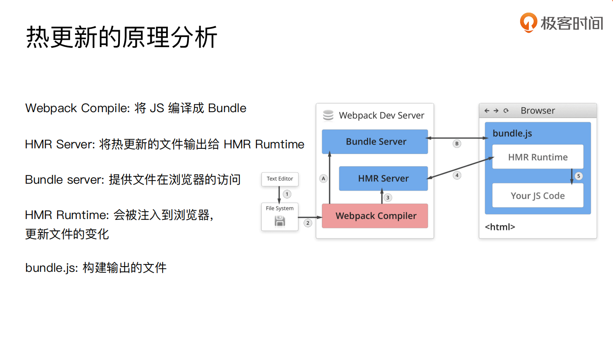

# Webpack

https://www.webpackjs.com/

## 2020/9/9

### 为什么选择Webpack

1. 社区活跃
2. 配置灵活  插件化扩展
3. 官方更新迭代速度快
4. 废话不多说

### 初识 webpack

默认配置文件 webpack.config.js
也可以通过 webpack --config 指定配置文件  主要应用在 多环境运用多  config.js


## 核心概念

### Entry 入口

#### 概念

用来指定 Webpack 的打包入口

为啥需要这么一个入口。

因为webpack将 js代码 css代码 或者说一些非代码文件 例如图片...当作一个模块
模块之间存在依赖关系。
然后根据入口文件找到依赖。
而依赖文件又有其他依赖，这样就形成了一颗依赖树
最终遍历完成 加载所有需要的模块

#### 用法

1. 单入口 字符串
适用于单页应用
```json
  {
    "entry": "./path/to/my/entry/file.js"
  }
```

2. 多入口  对象

```json
  {
    "entry": {
      "app": "./path/to/my/entry/file.js",
      "admin": "./src/app.js"
    }
  }
```

### Output 出口

Output 用来告诉 Webpack 如何将编译后的文件输出到磁盘

#### 用法

对于单入口 只需要文件名和对应的位置即可 __dirname 绝对路径

```json
{
  "output": {
    "filename": "bundle.js",
    "path": __dirname + "/dist"
  }
}
```

多入口的output

```js
module.exports = {
  entry: {
    app: "./path/to/my/entry/file.js",
    admin: "./src/app.js"
  },
  output: {
    filename: '[name].js', // 利用占位符
    path: __dirname + "/dist"
  }
}
```


### Loaders 加载器

#### 概念
webpack 开箱即用只支持 JS 和 JSON 两种文件类型，通过 Loaders 去支持其它文
件类型并且把它们转化成有效的模块，并且可以添加到依赖图中。

`本身是一个函数，接受源文件作为参数，返回转换的结果。`

而像前端生态中的 jsx  Vue template 都需要loaders去处理
Webpack原生不支持的，loaders帮助转换支持，才能加入到依赖图中去

#### 用法

```js
const path = require('path')
module.exports = {
  output: {
    filename: 'bundle.js'
  },
  // test => 匹配规则  use => 使用的loader 名称
  module: {
    rules: [
      { test: /\.txt$/, use: 'raw-loader' }
    ]
  }
}
```

### Plugins 插件

插件⽤于 bundle ⽂件的优化，资源管理和环境变量注⼊
作⽤于整个构建过程

可以理解：loaders没办法完成的事情 用Plugins去完成

plugins 可以作用于整个构建过程

HtmlWebpackPlugin 创建 html 文件去承载输出的 bundle。 不需手动添加 html
ZipWebpackPlugin 生成zip

#### 用法

```js
const path = require('path');
module.exports = {
  output: {
    filename: 'bundle.js'
  },
  plugins: [
    new HtmlWebpackPlugin({template: './src/index.html'})
  ]
};
```

### Mode

Mode ⽤来指定当前的构建环境是：production、development 还是 none
设置 mode 可以使⽤ webpack 内置的函数，默认值为 production

Mode 内置函数功能

development => process.env.NODE_ENV = development
开启 NamedChunksPlugin & NamedModulesPlugin

production => process.env.NODE_ENV = production
开启 FlagDependencyUsagePlugin & FlagIncludedChunksPlugin, ...TerserPlugin


## 应用

### 解析ES6

使⽤ babel-loader  babel的配置⽂件是：.babelrc

```JS
const path = require('path');
module.exports = {
  entry: './src/index.js',
  output: {
    filename: 'bundle.js',
    path: path.resolve(__dirname, 'dist')
  },
+ module: {
+   rules: [
+   {
+     test: /\.js$/,
+     use: 'babel-loader'
+   }
+  ]
+ }
};
```

匹配.js 文件 使用 babel-loader   而 babel-loader 依赖 babel

其中两块重要的地方 presets + plugins
可以把 plugins 的每一项对应一个功能
presets 是一系列  babel plugins 的集合
`yarn add @babel/core @babel/preset-env babel-loader -D`
```js
{
"presets": [
  + "@babel/preset-env" // =》 增加 ES6 的 babel preset 配置
 ],
"plugins": [
  "@babel/proposal-class-properties"
 ] 
}
```

### 解析css less

### 解析图片、文件

file-loader 可以解析 图片和字体文件
url-loader 也可以解析 不同的是 可以设置较⼩资源⾃动 base64


### 文件监听

--watch 参数
或者 config.js => watch: true

#### ⽂件监听的原理分析

轮询判断⽂件的最后编辑时间是否变化
某个⽂件发⽣了变化，并不会⽴刻告诉监听者，⽽是先缓存起来，等 aggregateTimeout

```js
module.export = {
  //默认 false，也就是不开启
  watch: true,
  //只有开启监听模式时，watchOptions才有意义
  wathcOptions: {
    //默认为空，不监听的文件或者文件夹，支持正则匹配
    ignored: /node_modules/,
    //监听到变化发生后会等300ms再去执行，默认300ms
    aggregateTimeout: 300,
    //判断文件是否发生变化是通过不停询问系统指定文件有没有变化实现的，默认每秒问1000次
    poll: 1000
  } 
}
```

> 但是以上都是需要手动刷新浏览器的。下面介绍热更新

### 热更新

#### 使⽤ webpack-dev-server

webpack-dev-serve + HotModuleReplacementPlugin

WDS 不刷新浏览器
WDS 不输出⽂件，⽽是放在内存中

#### 使⽤ webpack-dev-middleware

日常开发用得比较多

WDM 将 webpack 输出的⽂件传输给服务器
也就是我们的node 起的本地服务 类似localhost:8080
浏览器会和服务构建一个websocket服务，每当我们改变了代码，都会有个hotupdate文件，让浏览器更新。
适⽤于灵活的定制场景

